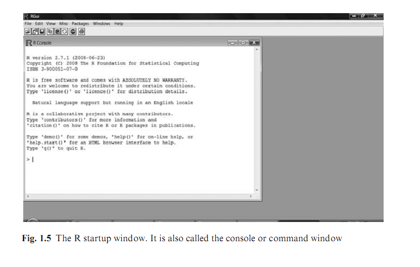
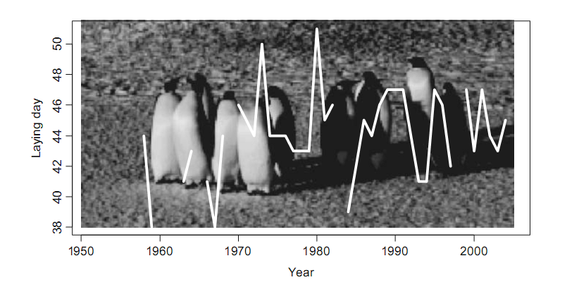

## The R window

<figure> </figure>

--- .class #id 

## Basic arithmetic

R input (copy and paste into R window)

```r
2 + 2  # R output (below)
```

```
## [1] 4
```


```r
2 + 2
```

```
## [1] 4
```

```r
2 + 2
```

```
## [1] 4
```


---
## Basic arithmetic


```r
log(2)
```

```
## [1] 0.6931
```

```r
log(10)
```

```
## [1] 2.303
```


---
## Basic arithmetic

Fails:
```
2 + 2*w
```


---
## Basic arithmetic

Need to define 'w'


```r
w <- 10
2 + 2 * w
```

```
## [1] 22
```


---
## Example 1

```
library(lattice)
dat <- read.table('data/ISIT.txt',header=TRUE,sep='\t')
xyplot(Sources~SampleDepth|factor(Station),data=dat,
xlab='Sample Depth',ylab='Sources',
strip=function(bg='white', ...)
strip.default(bg='white',...),
panel=function(x,y){
panel.grid(h=-1,v=2)
I1=order(x)
llines(x[I1],y[I1],col=1)})
```


---
## Example 1

 


---
## Writing R Code

It is impossible to remember all the commands and programs!

Therefore, VERY important to:

1. Write SIMPLE code
2. Write many comments describing what the code does: 

```
# a comment
```


---
## Example 1 with comments

```
# load libraries/packages
library(lattice)
# read in data
dat <- read.table('data/ISIT.txt',header=TRUE,sep='\t')

# Start plotting:
#   - plot Sources as a function of SampleDepth,
#   - use a panel for each Station
#   - use colour black (col = 1), and 
#   - specify x and y labels (xlab and ylab).
#   - use white background in the boxes that contain station labels

xyplot(Sources~SampleDepth|factor(Station),data=dat,
xlab='Sample Depth',ylab='Sources',
strip=function(bg='white', ...)
strip.default(bg='white',...),
panel=function(x,y){
  # avoid grid lines
  # avoid spaghetti plots
  # plot data as lines (in black)
panel.grid(h=-1,v=2)
I1=order(x)
llines(x[I1],y[I1],col=1)})
```


---
## More recommendations

- Use spaces to indicate groups of commands
- Use spaces around text

---
## Example 1 with comments and spaces

```
# load libraries/packages
library(lattice)
# read in data
dat <- read.table('data/ISIT.txt', header = TRUE, sep = '\t')

# Start plotting:
#   - plot Sources as a function of SampleDepth,
#   - use a panel for each Station
#   - use colour black (col = 1), and 
#   - specify x and y labels (xlab and ylab).
#   - use white background in the boxes that contain station labels
```

---
## Example 1 with comments and spaces and nesting

```
xyplot(Sources ~ SampleDepth | factor(Station), data = dat,
      xlab = 'Sample Depth', ylab = 'Sources',
      strip = function(bg = 'white', ...)
      strip.default(bg = 'white', ...),
      panel = function(x, y){
        # avoid grid lines
        # avoid spaghetti plots
        # plot data as lines (in black)
        panel.grid(h = -1, v = 2)
        I1 = order(x)
        llines(x[I1], y[I1], col = 1)
      } # close panel()
) # close xyplot
```


---
## Coding Style Guides

<q>Good style is important because while your code only has one author, it will usually have multiple readers</q>

Hadley Wickham

 - an [overview](http://pairach.com/2012/06/06/r-style-guide/)
   - [Google](https://google-styleguide.googlecode.com/svn/trunk/Rguide.xml)
   - Hadley Wickham's [guide](http://adv-r.had.co.nz/Style.html)
  

---
## Text editors

[Text editors](https://en.wikipedia.org/wiki/Text_editor) use unformatted plain text with no hidden characters or code. Thus, what you paste in to R is what runs. Most text editors also have nice [syntax highlighting](http://ethanschoonover.com/solarized).
Word processors such as MS-Word contain formatted text. 

### Common ones:

 - [Notepad](https://en.wikipedia.org/wiki/Notepad_%28software%29)
 - [TINN-R](http://sourceforge.net/projects/tinn-r/)
 - [WinEdt](http://www.winedt.com/)

### Hard-core
 - [emacs](https://www.gnu.org/software/emacs/)
 - [vi(m)](http://www.vim.org/)


## NEVER, NEVER M$-Word/equivalent!


---
## Graphics in R

<figure> </figure>

It is possible to do graphics that would maybe 
be faster in Excel ... 

  - <b>if</b> you only have to do them once, and 
  - <b>if</b> they are not too complex.


---
## The nightmare of many statisticians!

<figure> </figure>


---
## Packages

 - ~ ‘library’
 - A collection of previously programmed functions
 - Equivalent to many commercial software:
	e.g. Multivariate stats: vegan = PCORD, CANOCO etc.
 - Need to download from CRAN:

```
install.packages("foo")
library(foo) # or
require(foo)
```

---
## Quiting R

```
q()
```
Save workspace? Usually not.

Better to save commands as text files

```
rm(list = ls(all = TRUE))
```

