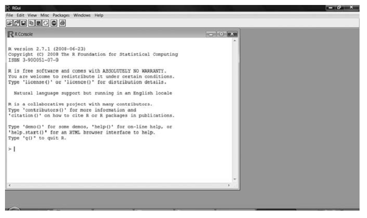
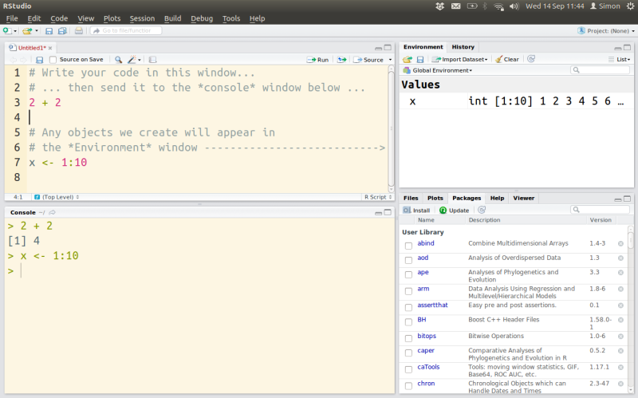
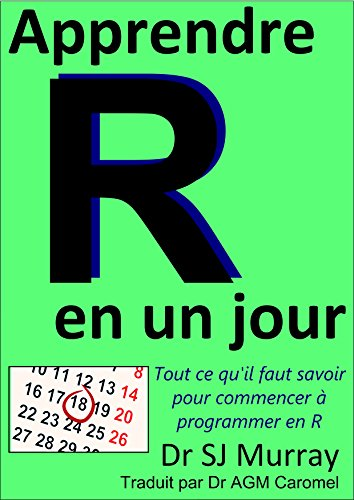
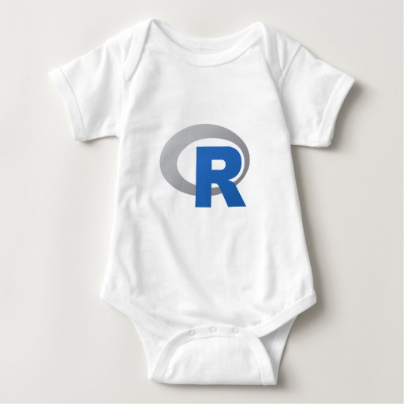

Hiding in Plain Text: Tools and Techniques for Teaching Effectively and Efficiently
=================================================
 

*Simon A. Queenborough* School of Forestry & Environmental Studies

Center for Teaching and Learning, Yale University | 2017-11-14


# What do I teach?

## FES720 Introduction to R


FES717 Tropical Field Ecology


# How did an ecologist end up teaching stats and programming?


# What is R?



*old-school R*


# Very different from IT experience of most learners


# Can be intimidating


# RStudio (IDE for R) is a bit  better, but not much




# Solution: Treat learning R as learning a foreign language




# Part 1: Teaching Effectively

## Mimics the way we naturally learn.

1. Motivation

2. Try something

3. Feedback (worked/didn't work)

4. Try again (same/different)


# Effective learning is based on:

2. Repetition

3. Assessment

4. Rapid feedback


# Traditional lecture class

 Lecture -> Textbook -> Homework -> Exam
 
 - Slow
 
 - Little opportunity for expert feedback


# A more interactive approach

 Reading -> Mini Lecture -> Interactive Lesson -> Lab w Feedback
 
 - Interactive use of computers allows this approach to scale up
 

# Interactive computer-based learning

Followed rapid, short-cycle approach.

 - 1920s 'teaching machines'.

 - 1950s B.F. Skinner "programmed instruction".
 
 - 1960s first generalised computer-assisted instruction system.
 
 - 1980s adapted to computer programming (LISP, Pascal).
 
 - 2000s internet, PCs: MOOCs, online tutorials, interactive textbooks, ...
 
 

# But, no good interactive environment for R

- learn R *outside* of R.

- each lesson was independent

- web-based console or copy and pasting code from online resource

- not open-source, so 

- unable to modify/contribute new material


# SWIRL fixes these issue

- Learn R, in R.

- Continuous session, like real data analysis

- Runs locally

- 100 percent open source

- Anyone can author and share content

- Integration with Coursera API/Google forms


# SWIRL: Statistics With Interactive R Learning


*Every new tech thing needs a nice acronym and logo*


# What SWIRL is

an R package for teaching and learning statistics and R **simultaneously** and **interactively**


# What SWIRL is

**Lessons** are a *dialogue* between swirl and the user

Composed of:
  - text output, 
  - multiple choice and text-based questions, 
  - and (most importantly) questions that require the user to enter actual R code at the prompt. 
  

**Responses** are evaluated for correctness based on instructor-specified answer tests.
 - Appropriate *feedback* is given immediately to the user.


# Why are we using swirl?

Students work directly in R console = real working environment.

Allows immediate evaluation of code and immediate feedback.

Allows remote logging of scores so I can check progress and provide feedback. 


# 1. Install SWIRL package

You only need to do this once.


```r
# install swirl. 
# Requires ""
install.packages("swirl")
```
 


# 2. Install the lessons

Lessons for FES720 are on my GitHub page

(github = social coding site, sharing code)


You only need to do this once (for now, until we find errors, etc)


```r
# load the swirl pakcage
library(swirl)

# access github and download the course
# (this function is provided with the swirl package)
install_course_github("saq", "fes720_Basic")
```

This command downloads the first set of lessons to your computer.


# 3. Start swirl

You will need to do this every time you start R or want to continue an old lesson or start a new lesson.


```r
# load the swirl package into your current R session
# (No need for "")
library(swirl)

| Hi! Type swirl() when you are ready to begin.

# start swirl ... 
# (swirl is a function, so you need '()')
swirl()
```


# 4. Choose a name


```r
> library(swirl)

| Welcome to swirl! Please sign in. 
| If you've been here before, use the same name as you did then. 
| If you are new, call yourself something unique.

What shall I call you? 
```

Enter your name.

I will need to be able to identify you, so please use:
 - firstname lastname, or 
 - Yale ID.

This name will also allow you to continue lessons if you stop them in the middle.

# 5. Choose a course


```r
| Please choose a course, or type 0 to exit swirl.

1: fes720 Basic
2: Take me to the swirl course repository!

Selection: 
```

We will be working through the lessons in the 'fes720 Basic' course.

Type: '1'


# 6. Choose a lesson


```r
| Please choose a lesson, or type 0 to return to course menu.

1: Basic Building Blocks
2. ...
...
```

Choose the first lesson: Basic Building Blocks

Type: '1'


# 7. Do the lesson!


```r
| Attempting to load lesson dependencies...

| Package ‘base64enc’ loaded correctly!

  |                                                                            |   0%

| In this lesson, we will explore some basic building blocks of the R programming language.

...
```

Hit 'Enter' to advance when presented with '...'

The screen also shows you how far through the lesson you are (0%).


# 8. Completing the lesson
 
**You will need to be connected to the internet to submit your lesson**

When you are done, the last question will ask if you want to submit your answers to me
to verify that your completed the lesson.

You should enter the number of your response (usually '1').

This will bring up a new web page, a Google form.

Scroll down, and click 'submit'.

This will send an excrypted response to the Google form so that I can verify you completed the lesson.


# How does SWIRL fit in with wider course structure?


# Learning Goals & Outcomes

Successful students will be able to:

1. **Foundational knowledge** (information and ideas)

 - Describe how R differs from spreadsheets and point-and-click software,
 - Prepare data for use in R,

. . .

2. **Application** (skills, thinking and project management)

 - Be confident managing, describing, analysing, and visualising data in R,
 - Write your own functions,
 - Generate publication-quality graphics,
 
 . . .


# Assessment

The course will be assessed via:

 - A set of lesson assignments (25%, not assessed, but completion of all lessons is required),   
 
 - A parallel set of lab problems (25%), submitted on Canvas.
 
 - Best Practice of the Week (25%),  submitted on Canvas.
 
 - One (1) data project report (25%).  

There are *no* final examinations.


# Weekly Plan

Sat/Sun: Reading before class

Mondays: Background lecture on topic and lessons

Wednesdays: Best Practice lecture and labs

Fridays: R Bootcamp


# How does this structure fit our model of learning?

1. Motivation

2. Repetition

3. Assessment

4. Rapid Feedback


# 1. Motivation

 - all students come with data OR work on real data for NGO.
 
 - data project as part of course.


# 2. Repetition

 - Lessons and labs build on each other sequentially, reinforcing skills.
 
 - Multiple similar tasks in lessons and labs, and on real data.
 
 - Two lessons a week (M, W), plus extended 'R Bootcamp' on Friday mornings.


# 3. Assessment

 - R provides immediate feedback if there is an error ...
 
 BUT

 - only if the code does not run, not if it is not what was intended.
 
 - SWIRL automagically checks the answer!
 


# 4. Rapid feedback

 - SWIRL provides immediate feedback and hints for what we are looking for.
 
 - Expert help from me and TA:
 
 - In-class as students work on lessons and labs.
 
 - Labs: we make comments on Canvas asssignments several times a week. Multiple 'submissions' allowed.
 


# Another solution ...




*Start them young*


# Part II: Teaching Efficiently


# Teaching efficiently (to me) means ...


- More time:
 
   - thinking,
   
   - planning,
   
   - interacting w students.


# Teaching efficiently (to me) means ...


- Less time:

 - Duplicating material (e.g., syllabus as hand-out + webpage, lecture as presentation + webpage, lesson as SWIRL + website/document).

 - Making things look pretty.
 
 
 

# Compounded by smartphone/tablet way of interacting with computers

- Single purpose applications

- hides the working

- hides the files and file structure
 
 

# A second IT revolution

Open-source tools for plain-text coding, data analysis, and writing are also better and more accessible than they have ever been.


# Office vs Engineering model of working

Based on work by [Kieren Healy](http://plain-text.co/)


# The Office Model

e.g., M.S. Word file

 - changes tracked inside

 - citations and reference managers plug in
 
 - outputs of data analysis pasted in
 
 
 

# The Engineering Model

e.g., plain-text file

 - changes tracked outside (version control)
 
 - data analysis managed in plain-text code
 
 - citations managed as plain-text
 
 - Final doc is assembled


# The Engineering Model


# Principles

1. Keep a Record

2. Write and Edit

3. Reproduce Work

4. Pull it Together


# 1. Keep a Record

## Know what you did

 - Record your actions (e.g., stats with code vs point and click)
 
 - Organize folders and files
 
 - Don't Repeat Yourself
 

## Use version control

 - similar to MS Word track changes, but adds comments
 
 - Use for code, data, manuscripts
 
 - Allows you to 'rewind'
 
 - Prevents: 'paper-final.doc', 'paper-final2.doc', 'paper-really-final.doc', ..
 
 e.g., git, subversion, ..

 - Allows sharing of your work and shared use of others
 
 e.g., Github
 

## Back up your work

e.g., Dropbox, YaleBox, ...


# 2. Write and Edit

## Use a Text Editor

 - Focus on **content**, appearance (typesetting) done elsewhere
 
 - Portable, open by anything
 
 - Highlighting (helps w code syntax, but can also error-check)
 
 - Possible to integrate text and code
 
 e.g., too many! Notepad+, ...
 
 


## Use Markdown 
 
- Now, a standard _mark-up_ language

- Simple format for structural info + easy to read

```
# 2. Write and Edit

## Use Markdown

- Now, a standard _mark-up_ language

- Simple format for structural info + easy to read
```


 
## Use R + IDE (e.g., RStudio/ESS)

- Syntax highlighting

- Error-checking


# 3. Reproduce Work

## Minimize error

 - Avoid errors creping in
 
 - Work out what you did 6 months ago!
 
 - Comment code and make it readable


## Decrease gap between data and results section

 - Ensure that your own analyses and results are repeatable
 
## How? Embed code within manuscript

 - Use R, Rmarkdown, knitr
 
```
Blah, blah, as you see in Fig. 1 blah ...

```r
# Embed chunks of code
my_data <- read.table('my_awesome_data.txt')
plot(my_data$x ~ my_data$y)
 
Now, turning to blah ... 
```


# 4. Pull it Together


# Further Reading

## plain text

http://wcm1.web.rice.edu/plain-text-citations.html

http://mnmlist.com/a-case-for-storing-all-your-info-in-text-files/

http://kieranhealy.org/blog/archives/2014/01/23/plain-text/

http://programminghistorian.org/lessons/sustainable-authorship-in-plain-text-using-pandoc-and-markdown


## Markdown
http://inundata.org/2012/12/04/how-to-ditch-word/

http://inundata.org/2012/06/01/markdown-and-the-future-of-collaborative-manuscript-writing/

http://wcm1.web.rice.edu/plain-text-citations.html

http://mnmlist.com/a-case-for-storing-all-your-info-in-text-files/

http://kieranhealy.org/blog/archives/2014/01/23/plain-text/

http://programminghistorian.org/lessons/sustainable-authorship-in-plain-text-using-pandoc-and-markdown

http://lifehacker.com/5943320/what-is-markdown-and-why-is-it-better-for-my-to+do-lists-and-notes

http://chronicle.com/blogs/profhacker/markdown-the-syntax-you-probably-already-know/35295

http://www.practicallyefficient.com/2011/07/21/word-internet/

http://markdowntutorial.com/

https://daringfireball.net/projects/markdown/basics 


## Reproducible research

http://conjugateprior.org/2013/03/tools-for-making-a-paper/

http://hybridpedagogy.com/Journal/files/GitHub_for_Academics.html

https://github.com/SChamberlain/esamd


======
# Resources


## Tools

[R](https://www.r-project.org/) A platform for statistical computing.

[RStudio](https://www.rstudio.com/) IDE for R.

[knitr](http://yihui.name/knitr/) Reproducible documents with R.

[LaTeX](http://tug.org/) Detailed mark-up language and typesetting system.

[pandoc](http://pandoc.org/) Converts plain-text to many other formats.

[git](https://git-scm.com/) Version control system.

[github](https://github.com/) Social web-based version of git.


## Guides

[Intro to R](http://www.simonqueenborough.info/R/intro/index.html) My course!

[RMarkdown cheatsheet](https://www.rstudio.com/wp-content/uploads/2015/02/rmarkdown-cheatsheet.pdf)

[RStudio cheatsheet](https://rstudio.com/resources/cheatsheets/)

